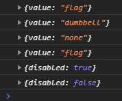

# Веб-компонент `flag-switcher`
Компонент предназначен для установки/снятия метки о наличии/отсутствии рисков/преимуществ. В нём, помимо 
пользовательских атрибутов, используется как встроенное (`change`), так и пользовательское (`disabling-change`) событие.


В приведённом ниже примере демонстрируется два способа использования веб-компонента `flag-switcher`: 
  * в HTML-документе.
  * в коде JavaScript.

Из приведённых ниже JavaScript-файлов мы соберём пакет, в который вкючим в т.ч. и код веб-компонента `flag-switcher`. 
На выходе получится один *минифицированный* js-файл, а так же его файл *маппинга* (map-файл). На всякий случай так же 
показано, как установить `Node.js` и `parcel`.
## Установка nvm и Node.js
Если на вашем компьютере уже установлены [nvm](https://github.com/nvm-sh/nvm) (или 
[nvm-windows](https://github.com/coreybutler/nvm-windows) в случае использования Windows) и с её помощью установлена 
хотя бы одна версия `Node.js`, то всё нормально. Если на вашем компьютере установлен **только** `Node.js`, то я 
рекомендую вам удалить его, после чего установить `nvm` и затем, **с его помощью**, устанавливать нужные вам версии 
Node.js. Тогда вы сможете установить столько версий Node.js, сколько вам потребуется и переключаться между ними по мере 
необходимости (для разных проектов могут требоваться разные версии Node.js).

Перечень версий Node.js, установленных на вашем компьютере с помощью `nvm` можно будет проверять следующей командой:
```
nvm list
```
Текущая версия Node.js при этом подсвечивается звёздочкой. После установки `nvm`, установить Node.js, к примеру, 
версии `14.15.1` и назначить её в качестве текущей можно так:
```
nvm install 14.15.1
nvm use 14.15.1
```
## Установка parcel (упаковщика веб-приложений)
Упаковщик веб-приложения мы будем устанавливать не глобально, а локально, т.е. индивидуально для проекта. Для этого 
будем использовать простое и удобное приложение - [parcel](https://ru.parceljs.org/).

В каталоге проекта инициализируйте `npm`, если вы этого ещё не сделали:
```
npm init -y
```
Устанавливаем `parcel`, а так же исправления, обнаруженные для npm-пакетов, которые он использует:
```
npm i -D parcel-bundler
npm audit fix
```
Для удобства использования `parcel` давайте добавим несколько скриптов в файл `package.json`:
```
"build": "npx parcel build src/index.js"
```
## Пример использования веб-компонента
В следующем примере показано, как создавать веб-компонент в HTML-файле, а так же как это делать с помощью JavaScript 
кода:
```html
<!DOCTYPE html>
<html lang="ru">
<head>
    <meta charset="UTF-8">
    <title>Пример</title>
</head>
<body>
<p>Пример использования веб-компонента
    <flag-switcher id="fs1" onchange="console.log(event.detail)" ondisabling-change="console.log(event.detail)">
    </flag-switcher>, указанного непосредственно в HTML-разметке.</p>
<br>
<button id="fs1-switcher" type="button" onclick="window.fs1.disabled = !window.fs1.disabled;
            event.target.textContent = window.fs1.disabled ? 'Разблокировать' : 'Блокировать';">Блокировать</button>
<p>А этот веб-компонент <span id="fs2-container"></span> добавлен с помощью JavaScript кода.</p>
</body>
<button id="fs2-switcher"></button>
<script type="text/javascript" src="dist/index.js"></script>
</html>
```
Наш файл исходный файл `src/index.js` выглядит следующим образом:
```javascript
// index.js
import {FlagSwitcher} from "./readme";

const fs2 = document.createElement(FlagSwitcher.tagName);
fs2.id = "fs2";
fs2.value = "dumbbell"; // подсветить иконку "преимущество"
fs2.disabled = false; // значение по умолчанию, но показано для наглядности

// Вместо этого можно использовать функцию обновления state в приложениях, использующих Redux.
const handler = (event => console.log(event.detail));

fs2.addEventListener("change", handler);
fs2.addEventListener("disabling-change", handler);

const fs2parent = document.getElementById("fs2-container");
fs2parent.appendChild(fs2);

// Блокировка/разблокировка компонента. Блокированный компонент выделяется серой рамкой
const btn = document.getElementById("fs2-switcher");

btn.textContent = fs2.disabled ? "Разблокировать" : "Блокировать";

btn.onclick = () => {
    fs2.disabled = !fs2.disabled;
    btn.textContent = fs2.disabled ? "Разблокировать" : "Блокировать";
}
```
Запускаем сборку нашего проекта:
```
npm run build
```
Теперь в браузере (не в Internet Explorer) открываем наш файл `index.html`. Результат выглядит следующим образом:


Щёлкая мышкой по флажкам можно переключать их состояние. При этом, благодаря обработчикам событий `onchange` и 
`ondisabling-change` в консоль будет выводиться информация о выполненных изменениях. Нажимая на кнопку `Блокировать` 
можно управлять блокировкой/разблокировкой веб компонента. У заблокированного компонента флажки недоступны для 
переключения. Всплывающая подсказка зависит от текущего состояния флажков. У заблокированного компонента присутствует
серая рамка по контуру, чтобы можно было визуально отличить его заблокированное состояние от не заблокированного. Для 
данного примера в консоли мы увидим следующее:



В реальных проектах в качестве обработчиков событий можно подключать функции, которые будут выполнять обновление, к 
примеру, `state` в React+Redux приложениях.

Управлять блокировкой веб-компонента можно при помощи добавления/удаления переключателя `disabled` в атрибутах 
веб-компонента. Управлять состоянием флажков можно при помощи атрибута `value`, при этом допустимы следующие значения: 
`none`, `flag`, `dumbbell`. Отсутствие атрибута `value` равносильно установке значения `none`.